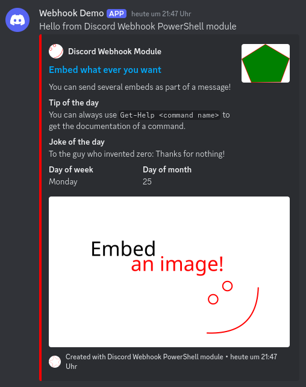

# Discord Webhook PowerShell Module
This is a simple [PowerShell 7](https://github.com/PowerShell/PowerShell/) module to send [Discord](https://discord.com) messages using the Discord Webhook API.

**Disclaimer:** This project is in no way affiliated with Discord.

## Installation
1. **Download the module**  
   The latest version of the module can be found at the projects [releases page](https://github.com/frankschierle/discord-webhook-ps/releases). Download the `.zip` file from there.

2. **Unzip**  
   Unzip the downloaded `.zip` file to your PowerShell modules directory:
   ```pwsh
   Expand-Archive -Path discord-webhook-x.x.x.zip -DestinationPath $env:PSModulePath.Split(':')[0]
   ```

## Using the module
The module is required to be imported using a [`using module` statement](https://learn.microsoft.com/en-us/powershell/module/microsoft.powershell.core/about/about_using). Remember that `using` statements are required to come before any other statements in a script!

The following example shows how to send a message to a Discord channel:
```pwsh
using module DiscordWebhook

$ghProjectPage = 'https://github.com/frankschierle/discord-webhook-ps'
$ghAssetsBase = 'https://raw.githubusercontent.com/frankschierle/discord-webhook-ps/refs/heads/main/assets'

$message = [DiscordMessage]::new().
    WithContent("Hello from Discord Webhook PowerShell module").
    WithEmbed([DiscordEmbed]::new().
        WithAuthor('Discord Webhook Module', $ghProjectPage, $ghAssetsBase + '/author.png').
        WithTitle('Embed what ever you want').
        WithUrl($ghProjectPage).
        WithDescription('You can send several embeds as part of a message!').
        WithThumbnail($ghAssetsBase + '/thumbnail.png').
        WithField('Tip of the day', 'You can always use `Get-Help <command name>` to get the documentation of a command.').
        WithField('Joke of the day', 'To the guy who invented zero: Thanks for nothing!').
        WithField('Day of week', 'Monday', $true).
        WithField('Day of month', '25', $true).
        WithImage($ghAssetsBase + '/image.png').
        WithFooter('Created with Discord Webhook PowerShell module', $ghAssetsBase + '/footer.png').
        WithTimestamp([DateTime]::UtcNow).
        WithColor(0xFF, 0x00, 0x00)
    )

Send-DiscordMessage `
    -Message $message `
    -WebhookUri 'https://discord.com/api/webhooks/1234567890/abc123'
```
And this is how it will be shown in Discord:



## License
Discord Webhooks PowerShell module is provided as-is under the MIT license. For more information see [LICENSE](LICENSE).
